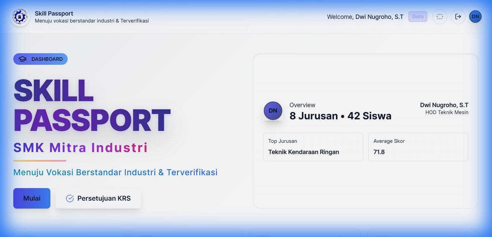
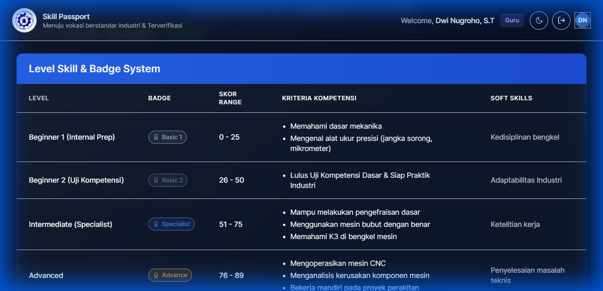
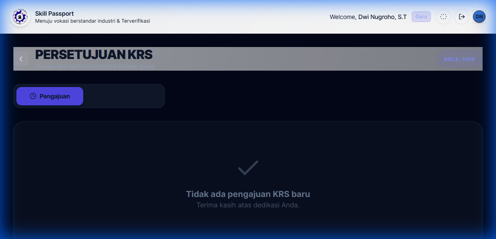

# Panduan Penggunaan Skill Passport (Guru & Admin)

Platform ini membantu Bapak/Ibu Guru dalam memantau secara real-time perkembangan kompetensi siswa sesuai dengan standar industri.

## 1. Cara Login
1. Buka halaman website **Skill Passport**.
2. Masukkan **Username** dan **Password** guru yang telah didaftarkan.
3. Klik tombol **Masuk**.
4. Setelah berhasil login, Anda akan diarahkan ke Dashboard utama.

## Pahami Peran Anda

Sistem ini membagi akses berdasarkan peran masing-masing pengajar untuk menjaga akurasi data:

### 1. Wali Kelas (Walas)
Tugas utama Anda adalah memantau kehadiran dan karakter siswa di kelas yang Anda ampu:
- **Dashboard**: Melihat rangkuman progres siswa di kelas Anda.
- **Update Kehadiran**: Klik Nama Siswa > Tab Kehadiran. Masukkan jumlah Masuk, Izin, Sakit, dan Alfa.
- **Monitoring Sertifikasi**: Anda dapat melihat status pendaftaran sertifikasi competency siswa kelas Anda.
- **Eksport & Laporan**: Gunakan tombol **Excel**, **CSV**, atau **Cetak** di Dashboard Walas untuk mengunduh rekapitulasi nilai dan kehadiran siswa dalam satu kelas.

> [!TIP]
> **[Baca Panduan Lengkap Wali Kelas (GUIDE_WALAS.md)](GUIDE_WALAS.md)** untuk detail pengelolaan kehadiran dan sikap.

### 2. Guru Produktif
Tugas utama Anda adalah memverifikasi kompetensi teknis siswa:
- **Edit Skor & Poin**: Memperbarui nilai kompetensi teknis (0-100) dan memberikan tambahan XP/Poin.
- **Verifikasi Sertifikasi (Tahap 1)**: Meninjau unit kompetensi yang dipilih siswa. Jika sudah layak uji, klik **Setujui**.
- **Input Nilai Ujian**: Setelah siswa tes, masukkan nilai akhir di menu Verifikasi Sertifikasi > Tab Penilaian Ujian.

> [!TIP]
> **[Baca Panduan Lengkap Guru Produktif (GUIDE_PRODUKTIF.md)](GUIDE_PRODUKTIF.md)** untuk detail verifikasi sertifikasi, penilaian ujian, dan daftar akun default.

### 3. HOD / Kaprog (Kepala Program Keahlian)
Tugas utama Anda adalah sebagai verifikator akhir dan pengelola standar jurusan:
- **Kelola Kriteria**: Mengubah kriteria kompetensi di setiap level (Menu Detail Jurusan > Level Skill).
- **Batch Approval**: HOD dapat menyetujui banyak pendaftaran sekaligus menggunakan checkbox dan tombol **Setujui Batch** untuk menjadwalkan ujian di tanggal yang sama.
- **Import Data**: Mengelola data massal siswa dalam satu jurusan (unggah file Excel/CSV).

> [!TIP]
> **[Baca Panduan Lengkap HOD (GUIDE_HOD.md)](GUIDE_HOD.md)** untuk detail manajemen standar kriteria dan validasi massal.

---

## Fitur Umum

### Pengelolaan Data Siswa
Setelah masuk ke halaman jurusan:
- **Filter Kelas**: Klik tab kelas (X, XI, XII) untuk menyaring daftar siswa.
- **Student Race**: Leaderboard visual yang menunjukkan posisi siswa berdasarkan skor.
- **Pencarian**: Gunakan fitur filter level untuk mencari siswa tertentu.

### Import & Hapus Data Massal
1. **Import Siswa**: Klik tombol **Import Siswa** untuk mengunggah daftar siswa baru via file Excel/CSV.
2. **Hapus Semua**: Gunakan tombol **Hapus Semua** hanya jika ingin membersihkan data seluruh siswa di jurusan tersebut.

### Cetak Sertifikat & Laporan
Siswa yang telah mencapai level tertentu dapat memiliki sertifikat PDF. Bapak/Ibu dapat membantu mendownloadkan sertifikat tersebut melalui modal detail siswa (Tab Riwayat).

---
*Skill Passport mempermudah administrasi dan meningkatkan transparansi progres belajar siswa.*
