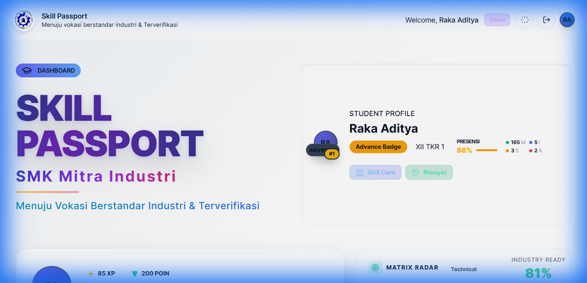
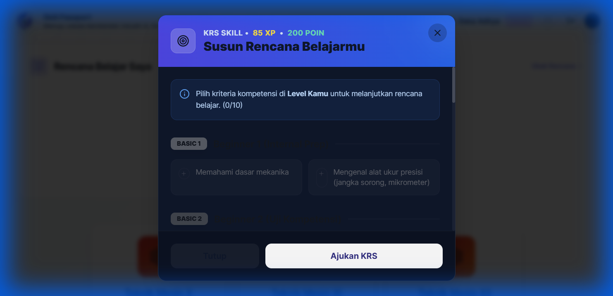
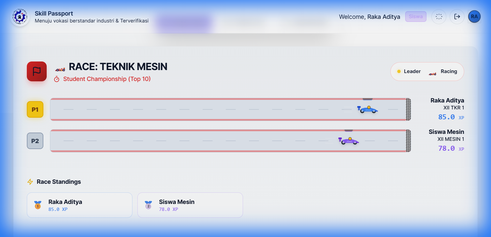

# Panduan Penggunaan Skill Passport (Siswa)

Selamat datang di **Skill Passport**! Platform ini dirancang untuk membantumu melacak pencapaian kompetensi, poin, dan progres belajarmu selama di sekolah.

## 1. Cara Login
1. Buka halaman website **Skill Passport**.
2. Masukkan **Username** dan **Password** yang diberikan oleh admin sekolah.
3. Klik tombol **Masuk Sistem**.

4. Setelah berhasil login, kamu akan melihat animasi **Passport Stamp** sebagai tanda kamu telah masuk ke sistem.

## 2. Dashboard Siswa
Setelah login, kamu akan melihat Dashboard utama yang berisi:
- **Profil Siswa**: Foto/Avatar, Nama, dan Kelas.
- **Statistik Skor**: Total Skor Kompetensi yang telah dicapai.
- **Peringkat**: Posisimu di dalam kelas.
- **Badge Level**: Level kompetensi saat ini (misal: Basic 1, Master).
- **Presensi**: Rangkuman kehadiran (Masuk, Izin, Sakit, Alfa).

## 3. Melihat Detail Kompetensi & Sertifikat
1. Klik tombol **Lihat Riwayat** atau bagian kartu profilmu.
2. Akan muncul jendela (modal) yang berisi detail lengkap:
   - **Tab Ikhtisar**: Menampilkan statistik kehadiran dan skor sikap.
   - **Tab Riwayat**: Menampilkan daftar kompetensi yang sudah lulus.
   - **Download Sertifikat**: Untuk kompetensi yang sudah lulus (Lulus), kamu bisa klik tombol **Download Sertifikat** untuk mengunduh bukti kompetensimu dalam bentuk PDF.

## 4. Kartu Rencana Studi (KRS) & Misi
Fitur ini digunakan untuk pengujian kompetensi mandiri:
1. Klik tombol **Misi / KRS** (ikon target/trofi).
2. Lihat **Misi Spesial** yang tersedia untuk menambah XP/Poin.
3. Di bagian **Daftar Unit Kompetensi**, kamu bisa melihat syarat untuk mencapai level berikutnya.
4. Pilih unit yang ingin kamu uji, lalu klik **Ajukan Persetujuan KRS**.

5. **Persetujuan & Jadwal Ujian**: 
   - Jika guru menyetujui, status akan berubah.
   - Jika HOD (Kepala Program) menjadwalkan ujian, kamu akan melihat **Notifikasi Berwarna Hijau** di Dashboard bertuliskan **"Ujian KRS Terjadwal!"**.
   - Catat tanggal dan jam ujian yang muncul di notifikasi tersebut.

## 5. Melihat Leaderboard & Student Race (Klik Kelas)
Kamu bisa melihat posisimu dibandingkan teman sekelas atau seangkatan:
1. Di halaman Utama, scroll ke bawah ke bagian kartu jurusan.
2. Kamu akan melihat pilihan kelas: **Kelas X, XI, dan XII**.
3. **Klik pada kartu kelasmu** (misal: "Teknik Mesin X").
4. Kamu akan diarahkan ke halaman detail yang menampilkan:
   - **Student Race**: Animasi balapan yang menunjukkan progres skor siswa secara visual.
   - **Podium**: Menampilkan 3 besar siswa dengan skor tertinggi.
   - **Daftar Siswa**: Tabel lengkap peringkat seluruh siswa di kelas tersebut.

## 6. Game Refleks (Hiburan)
Di bagian bawah (footer), terdapat game refleks sederhana. Kamu bisa memainkannya di sela-sela waktu istirahat untuk melatih ketangkasan klik!

## 7. Keluar (Logout)
Klik ikon **Logout** (pintu keluar) di pojok kanan atas untuk keluar dari sistem demi keamanan akunmu.

---
*Gunakan Skill Passport sebagai portofolio digitalmu untuk masa depan!*
