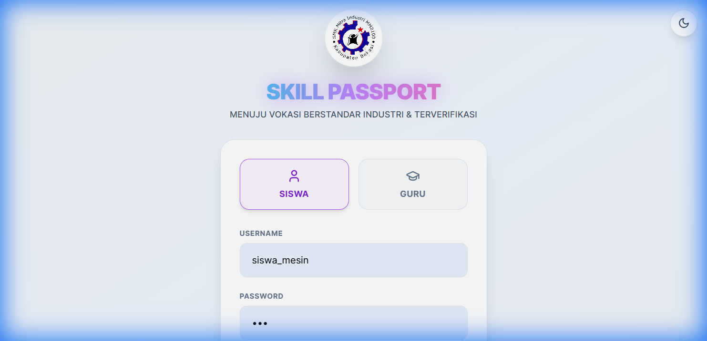

# Panduan Penggunaan Skill Passport (Wali Kelas)

Wali Kelas memiliki peran kunci dalam memantau perkembangan kompetensi dan kedisiplinan siswa di kelas binaannya.

## 1. Cara Login
1. Buka halaman website **Skill Passport**.
2. Masukkan **Username** dan **Password** wali kelas yang telah didaftarkan oleh admin.
3. Klik tombol **Masuk**.
4. Setelah berhasil login, Anda akan diarahkan ke Dashboard utama.

## 2. Dashboard Walas Insight
Setelah login, klik tombol **Walas Insight** (ikon dasbor) di halaman utama. Di sini Anda dapat melihat:
- **Total Siswa**: Jumlah siswa di kelas Anda.
- **Rata-rata Skor**: Performa rata-rata kompetensi kelas.
- **Sertifikasi Aktif**: Jumlah siswa yang sedang dalam proses pengajuan sertifikasi.

## 3. Monitoring Siswa
Daftar siswa diurutkan secara alfabetis. Anda dapat melihat:
- **Level & Progres**: Level saat ini dan progres XP menuju level berikutnya.
- **Status KRS**: Status pendaftaran sertifikasi (Review Guru, Tunggu Ujian, dll).
- **Lihat Passport**: Klik tombol ini untuk melihat riwayat unit kompetensi yang sudah dicapai siswa.

## 4. Manajemen Kehadiran & Sikap
Wali Kelas bertanggung jawab memperbarui data disiplin siswa:
1. Klik tombol **Kelola & Hadir** pada baris siswa terkait.
2. Pada jendela yang muncul:
   - **Tab Kehadiran**: Masukkan jumlah Masuk, Izin, Sakit, dan Alfa. Persentase kehadiran akan dihitung otomatis.
   - **Tab Skor Sikap**: Berikan penilaian untuk aspek non-teknis seperti Disiplin, Tanggung Jawab, dan Kerja Sama.
3. Klik **Simpan Perubahan**.

## 5. Eksport Data & Pelaporan
Gunakan fitur pelaporan di pojok kanan atas Dashboard Walas:
- **Excel/CSV**: Mengunduh rekapitulasi data seluruh siswa kelas dalam format spreadsheet.
- **Cetak**: Membuka tampilan laporan yang rapi untuk dicetak langsung sebagai laporan perkembangan siswa.

## 6. Bantuan Siswa
Anda juga dapat membantu memperbarui profil dasar siswa (Nama/Kelas) jika terjadi kesalahan penulisan melalui tombol **Kelola & Hadir**.

---
*Gunakan data Walas Insight untuk mendukung bimbingan siswa yang lebih tepat sasaran.*
